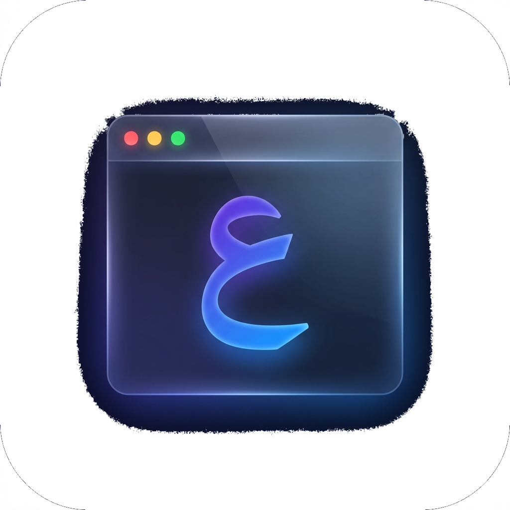

<p align="center">
  
</p>

<h1 align="center">RTL Terminal</h1>

<p align="center">
  <strong>The first VS Code terminal that properly renders Arabic, Hebrew, Persian, and Urdu.</strong>
</p>

<p align="center">
  <a href="https://marketplace.visualstudio.com/items?itemName=khalid-alzahrani.ar-terminal">
    
  </a>
  <a href="https://github.com/alzahrani-khalid/ar-terminal">
    
  </a>
</p>

---

## The Problem

VS Code, Cursor, and Antigravity all use **xterm.js** for their terminal — and xterm.js doesn't support Arabic text shaping. Arabic text appears with disconnected, unreadable letters:

```
ه ذ ا  م ث ا ل  ع ر ب ي
```

## The Solution

RTL Terminal renders Arabic correctly — connected letters, proper word shapes, fully readable:

```
هذا مثال عربي
```

## Features

| Feature | Details |
|---|---|
| **Arabic text shaping** | Proper letter joining with contextual forms (initial, medial, final, isolated) |
| **All RTL languages** | Arabic, Hebrew, Persian, Urdu |
| **Auto-detection** | Automatically activates when RTL text is detected |
| **Full terminal emulation** | Powered by xterm.js — cursor, scrollback, scrolling, resize |
| **ANSI colors** | Full support for 16, 256, and RGB colors |
| **Claude Code** | Read and write Arabic in Claude Code sessions |
| **Nerd Fonts** | Powerline glyphs and icons render correctly |
| **Keyboard shortcut** | `Cmd+Shift+T` (Mac) / `Ctrl+Shift+T` (Win/Linux) |
| **Custom cursor** | Blinking cursor on Arabic lines |
| **Cross-platform** | macOS, Linux, and Windows |

## Installation

Search **"RTL Terminal"** in the VS Code Extensions sidebar, or run:

```bash
code --install-extension khalid-alzahrani.ar-terminal
```

## Usage

1. Press **`Cmd+Shift+T`** (Mac) or **`Ctrl+Shift+T`** (Windows/Linux)
2. Or open Command Palette → **"RTL Terminal: New Terminal"**
3. Or click the **RTL Terminal** icon in the sidebar

Use it like any terminal — Arabic text renders correctly automatically.

## Works With

- **Claude Code** — full Arabic support in conversations
- **zsh / bash / PowerShell** — all shells supported
- **git** — Arabic commit messages, branch names
- **npm / node** — Arabic output from scripts
- **ssh** — remote sessions with Arabic text
- **vim / htop / less** — TUI apps work normally (overlay auto-disables)

## How It Works

RTL Terminal uses a hybrid rendering approach:

```
Shell (zsh/bash/PowerShell)
    ↓ raw output
node-pty (PTY process)
    ↓ terminal data
xterm.js (full terminal emulation)
    ↓ rendered buffer
DOM Overlay (browser text engine)
    ↓ connected Arabic letters
WebView Panel (VS Code)
```

1. **xterm.js** handles all terminal logic — cursor positioning, scrollback, ANSI escape codes, input handling
2. **DOM overlay** scans each visible line for RTL characters
3. Lines with Arabic text get an **HTML overlay** on top of the canvas
4. The **browser's native text engine** renders the Arabic with proper letter connections
5. Non-Arabic lines are untouched — zero overhead

## Commands

| Command | Shortcut | Description |
|---|---|---|
| RTL Terminal: New Terminal | `Cmd+Shift+T` / `Ctrl+Shift+T` | Open a new RTL Terminal |
| RTL Terminal: Toggle Mode | — | Cycle between auto/on/off |
| RTL Terminal: Set Mode On | — | Force RTL processing on all lines |
| RTL Terminal: Set Mode Off | — | Disable RTL processing |
| RTL Terminal: Set Mode Auto | — | Auto-detect RTL text (default) |

## Settings

| Setting | Default | Description |
|---|---|---|
| `rtlTerminal.mode` | `auto` | RTL processing mode: `auto`, `on`, or `off` |
| `rtlTerminal.shell` | — | Shell executable (auto-detects if empty) |
| `rtlTerminal.shellArgs` | `[]` | Arguments to pass to the shell |

## Platform Support

| Platform | Status |
|---|---|
| macOS ARM (M1/M2/M3/M4) | Supported |
| macOS Intel | Supported |
| Linux x64 | Supported |
| Linux ARM64 | Supported |
| Windows x64 | Supported |
| Windows ARM64 | Supported |

## Building from Source

```bash
git clone https://github.com/alzahrani-khalid/ar-terminal.git
cd ar-terminal
npm install
npx @electron/rebuild -v 32.3.2 -m . --only node-pty
npx vsce package --allow-missing-repository
code --install-extension ar-terminal-*.vsix
```

> **Note:** The `electron-rebuild` step compiles `node-pty` for VS Code's Electron version. Check your VS Code version if `32.3.2` doesn't match.

## Known Limitations

- Opens as an **editor tab**, not in the terminal panel (VS Code API limitation)
- Brief flash (~30ms) of disconnected Arabic before the overlay renders
- Text selection on Arabic lines copies from xterm.js underneath

## Contributing

Contributions are welcome! Please open an issue or PR on the [GitHub repository](https://github.com/alzahrani-khalid/ar-terminal).

## License

MIT
